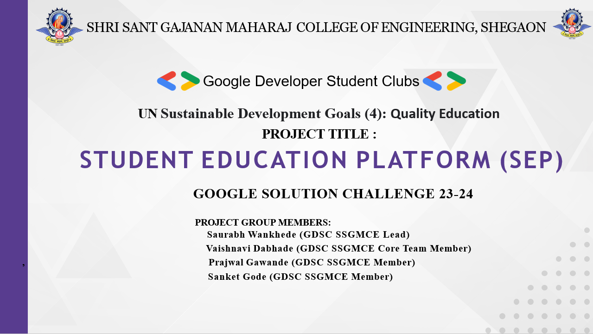
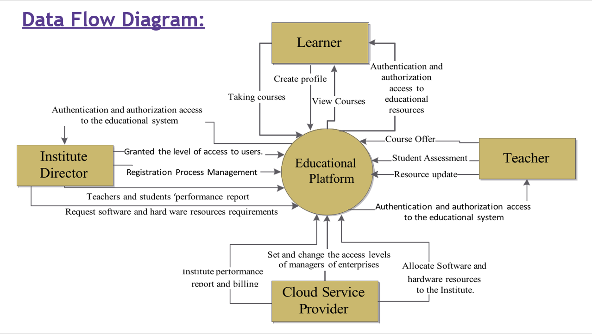
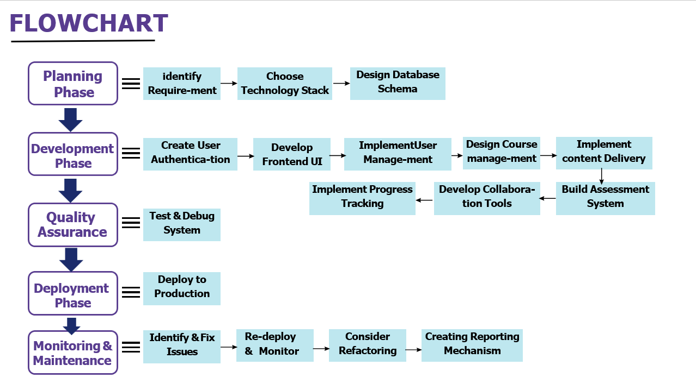
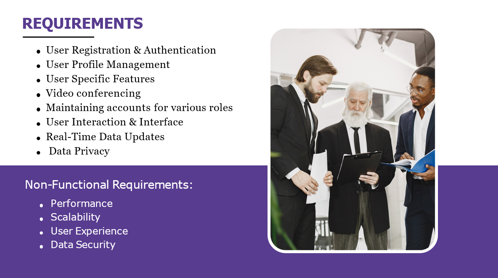
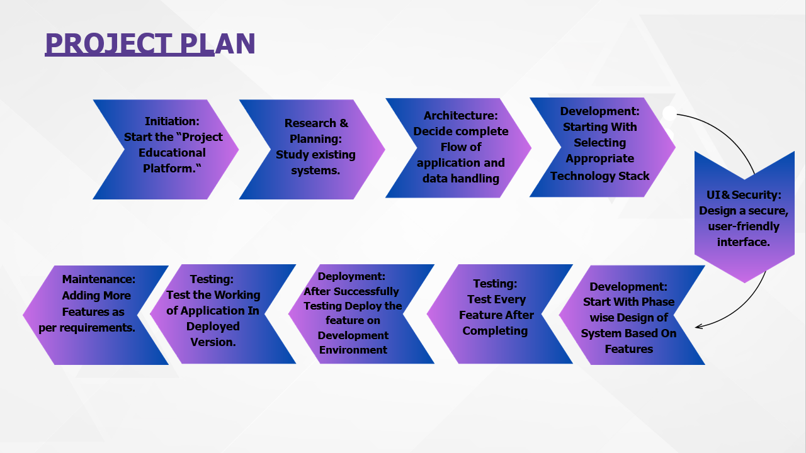

# Student Education Platform (SEP)

## Introduction

SEP is an initiative under the GOOGLE SOLUTION CHALLENGE 23-24, addressing UN Sustainable Development Goal 4: Quality Education. This platform is designed by the team at SSGMC Gemini, and aims to enhance the educational experience for students and educators alike.

## Project Group Members

- Saurabh Wankhede - GDSC SSGMCE Lead
- Vaishnavi Dabhade - GDSC SSGMCE Core Team Member
- Prajwal Gawande - GDSC SSGMCE Member
- Sanket Gode - GDSC SSGMCE Member

## Data Flow Diagram

The data flow diagram illustrates the interactions between different stakeholders (Institute Director, Learner, Teacher, and Cloud Service Provider) within the Educational Platform.

## Flowchart

The flowchart provides a visual representation of the software development lifecycle for the SEP, detailing each phase from planning to monitoring and maintenance.

## Requirements

A detailed list of functional and non-functional requirements such as User Registration & Authentication, User Profile Management, Real-Time Data Updates, Data Privacy, Performance, Scalability, User Experience, and Data Security.

## Project Plan

An outline of the project plan including various phases like Initiation, Research & Planning, Architecture, Development, Deployment, and Maintenance.

## Google Cloud Overview

Google Cloud encompasses a vast array of products, technologies, and services designed for digital operations. It includes Google Cloud Platform, G Suite, machine learning tools, APIs, and enterprise Maps APIs, optimized for cloud performance from the outset.

### Key Features:

- AI-optimized infrastructure including TPU Accelerators.
- Comprehensive security and privacy standards.
- Enterprise-appropriate engineering with integrated systems.
- Customer-centric support with customer engineers, reliability engineers, and product engineers.

## Deploying on Google Cloud

To deploy applications on Google Cloud, developers can use services like Compute Engine. The process includes:

- Cloning source repositories.
- Setting up initial code compilations.
- Configuring and deploying instances for backend and frontend services.
- Network configuration for communication between services.

### API and Services

Google Cloud's API library provides links to tutorials, documentation, and API Explorer for interactive testing. The API dashboard offers detailed information on API usage, traffic levels, error rates, and latencies, helping to quickly identify issues.

### Collaborations and Initiatives

Google Cloud has partnered with startups like Mistral AI to distribute large language models on its infrastructure, highlighting the platform's commitment to supporting cutting-edge AI research and development.

## Google AI Developer Documentation

Google AI introduces Gemini, Google's most capable AI model, optimized for performance across various tasks including text, code, audio, image, and video processing. Gemini is designed to be multimodal, meaning it can understand and operate across different types of information seamlessly.

For developers, Google AI Studio provides a web-based tool for prototyping with Gemini, allowing for rapid development and testing of AI applications right in the browser. To get started with building applications using the Gemini API.

## TensorFlow API Documentation

TensorFlow provides an extensive set of APIs available in several languages, with the Python API being the most comprehensive and user-friendly. TensorFlow v2.15.0.post1 has enhanced features that include community-supported languages such as Haskell, C#, Julia, R, Ruby, Rust, Scala, and Perl. It also offers APIs for C++, Java, and others, which may offer performance advantages in graph execution. For detailed API documentation, including installation, guides, and tutorials.

TensorFlow Core is designed for ML developers and researchers who require fine-grained control over their models. The Core APIs offer low-level building blocks for machine learning models and are ideal for creating highly configurable models with a fine level of control over operations. This makes TensorFlow a powerful tool for scientific computing beyond machine learning applications.

## Firebase Documentation

Firebase is a platform developed by Google for creating mobile and web applications. It offers a variety of services such as real-time databases, authentication, analytics, and hosting. The Firebase Documentation provides all the information necessary to start building applications with Firebase, including guides on how to add Firebase to your app, build, release, and monitor your apps, and engage with users.

## Vite.js Guide

Vite is a modern frontend build tool that significantly improves the frontend development experience. It provides a fast development server with features like Hot Module Replacement (HMR) and uses Rollup for building your code for production. The Vite.js guide offers comprehensive documentation to help you get started with Vite, optimize your development workflow, and configure your project for production deployment.

## References

Links to the documentation of various technologies and services used in the project:

- [Google Cloud Documentation](https://cloud.google.com/docs)
- [Google AI Developer Documentation](https://ai.google.dev/docs)
- [TensorFlow API Documentation](https://www.tensorflow.org/api_docs)
- [Firebase Documentation](https://firebase.google.com/docs)
- [Vite.js Guide](https://vitejs.dev/guide/)
